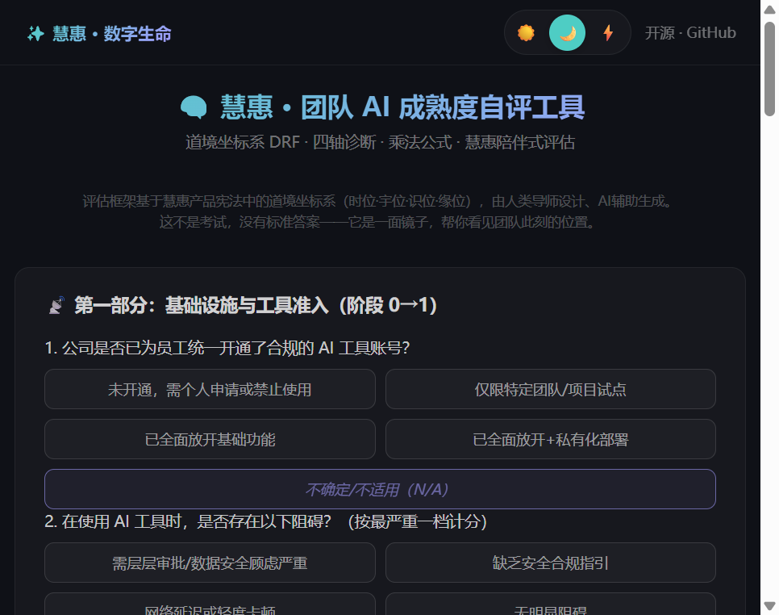

# 团队 AI 成熟度自评工具

> 一个开源的团队 AI 成熟度自评工具，基于四轴诊断模型（宇位 / 时位 / 识位 / 缘位），15 道题快速评估团队 AI 采用阶段。



## 项目简介

随着 AI 技术加速渗透到软件工程、产品设计、运营管理等各个环节，团队管理者面临一个共同的问题：**我们的团队到底处于 AI 采用的哪个阶段？下一步该往哪里走？**

本工具基于**旋量-太极模型（Spinor-Taiji Model）**的四轴诊断框架，结合 Boris Cherny 的 AI 采用五阶段理论，将评估过程压缩为 **15 道核心问题**，帮助团队在 5 分钟内完成一次全面的 AI 成熟度自评。

### 核心功能

- 🎨 **三种主题**：浅色模式、深色模式、高对比度模式，满足不同场景下的阅读需求
- 📊 **四轴雷达图**：宇位、时位、识位、缘位四个维度以雷达图直观呈现
- 🧭 **阶段诊断**：自动匹配五阶段（辅助模式 → 并行模式 → 自主运行 → 常驻智能体 → AI 原生）
- ✖️ **乘法乘积**：以四轴乘积衡量团队 AI 能力的"综合当量"
- 📅 **本周行动建议**：基于当前评分智能生成可落地的改进建议
- 📜 **历史记录追踪**：保存每次评估结果，可视化成熟度变化趋势
- ❓ **N/A 选项**：支持跳过不适用的题目，确保评估结果真实反映团队现状
- 📱 **移动端适配**：响应式设计，手机、平板、桌面均可流畅使用

## 快速开始

本工具是一个**纯静态 HTML 应用**，无需安装任何依赖，只需三步即可开始使用：

1. **下载或克隆仓库**

   ```bash
   git clone https://github.com/YOUR_USERNAME/team-ai-maturity-tool.git
   cd team-ai-maturity-tool
   ```

2. **用浏览器打开 `index.html`**

   直接双击 `index.html` 文件，或在终端中运行：

   ```bash
   # macOS
   open index.html

   # Windows
   start index.html

   # Linux
   xdg-open index.html
   ```

3. **开始自评**

   点击页面上的"开始评估"按钮，回答 15 道选择题，提交后即可查看完整的成熟度诊断报告。

> 💡 **提示**：无需安装 Node.js、Python 或任何其他运行时环境。一个浏览器就够了。

## 一键部署到 GitHub Pages

如果你想将工具部署到公网，方便团队成员随时访问，只需三步：

1. **Fork 本仓库**

   点击右上角的 <kbd>Fork</kbd> 按钮，将仓库复制到你自己的 GitHub 账号下。

2. **启用 GitHub Pages**

   进入你 Fork 后的仓库页面 → <kbd>Settings</kbd> → 左侧菜单 <kbd>Pages</kbd> → 在 **Source** 下拉栏中选择 **"GitHub Actions"**。

3. **等待自动部署**

   项目已内置 GitHub Actions 工作流（`.github/workflows/deploy.yml`），选择 GitHub Actions 作为 Source 后将自动触发部署。你可以在仓库的 <kbd>Actions</kbd> 标签页查看部署进度。部署完成后，访问：

   ```
   https://你的用户名.github.io/team-ai-maturity-tool/
   ```

> 💡 **提示**：每次向 `main` 分支推送代码，GitHub Pages 都会自动重新部署。

## 评分方法论

### 题目结构

本工具共 **15 道计分题**，分为四个核心维度，每个维度对应团队 AI 成熟度的一个关键方面：

| 维度 | 含义 | 题目编号 | 考察重点 |
|------|------|----------|----------|
| **宇位**（资源） | 团队所拥有的 AI 资源禀赋 | Q1, Q2, Q3, Q9, Q13 | 工具可用性、权限配置、基础设施完善度 |
| **时位**（节律） | AI 融入工作流的节奏与频率 | Q4, Q5, Q8 | AI 在例会、开发、文档等环节的使用频率 |
| **识位**（觉知） | 对 AI 的认知水平与信任程度 | Q6, Q11, Q15 | 团队成员对 AI 能力的理解、信任与批判性思维 |
| **缘位**（反馈） | 质量保障与反馈闭环机制 | Q7, Q10, Q12, Q14 | 代码审查、输出验证、反馈收集与迭代改进 |

### 评分规则

- **评分制**：每道题采用 **1 ~ 5 分制**，分数越高表示该维度越成熟
- **N/A 选项**：若某道题对团队不适用（如尚未使用 AI 编程工具），可选择 N/A 跳过，该题不计入总分
- **总分折算**：所有有效题目的得分之和按比例折算到 **64 分满分**，确保跳过题目后评分仍然公平可比

### 五阶段诊断

折算后的总分对应以下五个 AI 采用阶段：

| 分数区间 | 阶段名称 | 核心特征 |
|----------|----------|----------|
| 0 – 24 | 🛠️ **辅助模式** | 零星使用 AI 工具，无系统化流程，AI 作为"外挂"存在 |
| 25 – 34 | 🔄 **并行模式** | AI 与人工工作流并行，部分环节已常规化使用 AI |
| 35 – 44 | 🤖 **自主运行** | AI 承担部分独立任务，团队开始建立 AI 使用规范 |
| 45 – 54 | 🧠 **常驻智能体** | AI 智能体嵌入日常工作，具备持续上下文与主动建议能力 |
| 55 – 64 | 🌐 **AI 原生** | 团队流程以 AI 为核心重新设计，AI 深度参与决策与执行 |

## 配置反馈功能（可选）

本工具支持用户提交使用反馈。如需启用反馈收集功能，请按以下步骤配置：

1. 在 `index.html` 中搜索 `__FEEDBACK_API_URL__`
2. 将 `__FEEDBACK_API_URL__` 替换为你自己的反馈收集 API 端点地址
3. 你的 API 需要接收 `POST` 请求，请求体（Request Body）格式为 JSON：

```json
{
  "source": "team-ai-maturity-tool",
  "content": "用户反馈的文本内容",
  "contact": "用户填写的联系方式（选填）",
  "type": "feedback",
  "files": []
}
```

> ⚠️ **注意**：如果不替换 `__FEEDBACK_API_URL__`，反馈功能将不会发送任何数据，不影响工具的正常使用。

## 贡献指南

我们欢迎任何形式的贡献！无论是 Bug 反馈、功能建议，还是代码贡献，都可以通过以下方式参与：

### 提交 Issue

- 🐛 发现 Bug？请提供复现步骤和浏览器环境信息
- 💡 有新功能想法？请描述使用场景和期望效果
- ❓ 使用遇到问题？欢迎在 Issue 中提问

### 提交 Pull Request

1. **Fork** 本仓库并创建你的功能分支
2. 在本地进行开发和测试
3. 运行测试确保没有回归问题：

   ```bash
   python tests/test_calculations.py
   ```

4. 提交 PR 时请清晰描述改动内容和原因

### 代码风格

- 保持与现有代码一致的缩进和命名风格
- HTML / CSS / JavaScript 均为原生实现，无外部框架依赖
- 修改涉及计算逻辑时，请同步更新 `tests/test_calculations.py`

## 许可证

本项目基于 [MIT License](LICENSE) 开源发布。你可以自由使用、修改和分发本工具，只需保留原始版权声明。

详见 [LICENSE](LICENSE) 文件。

## 致谢

- **理论框架**：旋量-太极模型（Spinor-Taiji Model） × Boris Cherny AI 采用五阶段理论
- **原始项目**：[spinortaiji.com](https://spinortaiji.com)

---

<p align="center">
  <sub>Made with ❤️ by the Spinor-Taiji community</sub>
</p>